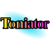
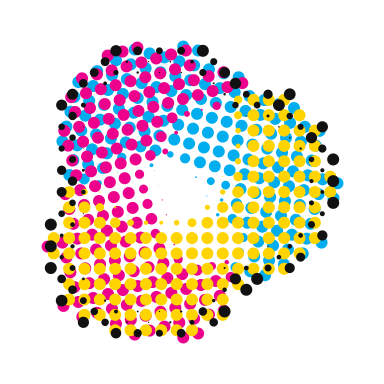
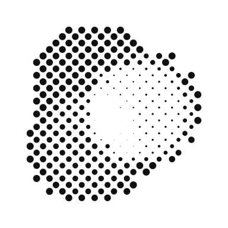
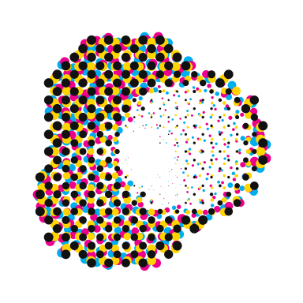
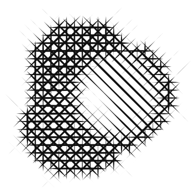

# Toniator

<p align="center">
  
</p>

Toniator is a native Linux application for turning raster or SVG artwork into
expressive vector halftones. It supports conventional CMYK screens, single-ink
treatments, monochrome crosshatching, custom cubic Bézier marks, and editable
curve-based patterns. The shipping application is written in Rust with GTK 4
and libadwaita; it does not embed a browser or wrap the archived web interface.

Toniator is currently version 0.1.0 and under active development. It is useful
for creative work today, but its color conversion is intentionally artistic
rather than ICC-managed or press-calibrated.

## Project history

Toniator began as a concept for an Inkscape-oriented vector halftone generator:
sample an image, map its values into ink channels, and use editable shapes or
curves instead of limiting every screen to round dots.

The first working version was a small JavaScript/Vite browser demo. That proof
of concept established the visual model, per-ink CMYK controls, shape and curve
marks, live preview, presets, and vector SVG generation. It also made the next
step clear: a serious creative application needed native file handling,
background rendering, recovery, predictable color-layer export, and a desktop
interface that did not depend on a browser runtime.

The current Toniator is that native rewrite. The rendering and document layers
are Rust libraries, the interface is GTK 4/libadwaita, and SVG rasterization and
export use Rust-native libraries. The original web demo remains in
[`archive/webapp`](archive/webapp/README.md) as a historical and behavioral
reference; it is no longer the shipping application.

## Source mappings

Source Mapping determines which information Toniator reads from the artwork and
how that information drives the ink screens. These SVG examples are the same
visual explanations embedded in the application.

<table>
  <thead>
    <tr>
      <th>Mapping</th>
      <th>Source</th>
      <th></th>
      <th>Result</th>
      <th>Use</th>
    </tr>
  </thead>
  <tbody>
    <tr>
      <td><strong>Color → CMYK Inks</strong></td>
      <td></td>
      <td>→</td>
      <td></td>
      <td>Separates source color into cyan, magenta, yellow, and black screens.</td>
    </tr>
    <tr>
      <td><strong>Value → One Ink</strong></td>
      <td></td>
      <td>→</td>
      <td></td>
      <td>Uses source value to control one selectable ink for a monochrome result.</td>
    </tr>
    <tr>
      <td><strong>Value → All Inks</strong></td>
      <td></td>
      <td>→</td>
      <td></td>
      <td>Applies the same value structure to every enabled ink.</td>
    </tr>
    <tr>
      <td><strong>Value → Crosshatch</strong></td>
      <td></td>
      <td>→</td>
      <td></td>
      <td>Builds a configurable monochrome crosshatch from independently editable ink layers.</td>
    </tr>
  </tbody>
</table>

The CMYK-like conversion is a creative numerical mapping, not a color-managed
separation. Always validate output in the color-managed tool used for final
production.

## What Toniator can do

- Import PNG, JPEG, WebP, or SVG artwork, including drag-and-drop. Imported SVG
  is rasterized for sampling; Toniator generates new vector halftone geometry
  rather than preserving the source SVG object structure.
- Create Shapes treatments from circles, regular three- through six-sided
  polygons, or closed user-defined cubic Bézier marks.
- Create Curves treatments from Straight, Soft Wave, Deep Wave, or Custom
  profiles, either across the page or as repeated motifs.
- Share geometry across CMYK inks or give each ink its own shape or curve.
- Edit anchors and Bézier handles directly, with gesture-level undo/redo and
  cancellable editing sessions.
- Adjust coverage, screen and mark angle, width/height scale, threshold,
  opacity, detail, curve weight/spacing, position, and motif arrangement.
- Switch instantly between cached Source and Rendered views; use Fit or an
  explicit zoom from 5% through 800%.
- Save complete working documents, save reusable treatment presets, recover an
  interrupted editing session, and protect unsaved work before destructive
  actions.
- Export an editable, full-artboard SVG with multiply-composited Inkscape CMYK
  layers, or a flattened PNG with a white or transparent background.

Legacy Lines state is retained for compatible imported material and regression
coverage, but Lines is not offered as a new-work treatment.

## Basic workflow

1. Select **New** or **Open**, then load PNG, JPEG, WebP, or SVG artwork.
2. Choose a Source Mapping based on whether color or value should drive the
   treatment.
3. Choose **Shapes** or **Curves**, then select a built-in mark/profile or edit
   your own.
4. Start with **All Inks** (**All Layers** in crosshatch mode) for broad
   adjustments. Disable shared geometry or target C, M, Y, or K when an
   individual separation needs different settings.
5. Use **Source** to compare against the original and **Fit** to keep the full
   artboard visible.
6. Save the project as `.toniator`, optionally save the treatment as `.tntr`,
   and export SVG or PNG when the result is ready.

Keyboard shortcuts:

- `Ctrl+O` — Open
- `Ctrl+S` — Save
- `Ctrl+Z` — Undo
- `Ctrl+Shift+Z` or `Ctrl+Y` — Redo
- `Ctrl+E` — Export

## File formats

| Format | Purpose |
| --- | --- |
| PNG, JPEG/JPG, WebP | Raster source artwork |
| SVG | Vector source artwork, rasterized internally for sampling |
| `.toniator` | Versioned JSON working document containing artwork, treatment, and editor state |
| `.tntr` | Reusable treatment/preset only; it does not contain artwork or document identity |
| SVG export | Newly generated editable vector halftone with C/M/Y/K layers |
| PNG export | Flattened document-size, 2×, or linked custom-size raster output |

Working-document saves are atomic. Toniator currently reads document versions
1–3 and writes version 3. Preset import accepts native presets and a validated
subset of useful legacy v1 treatments; unsupported or malformed presets are
rejected before the current document is changed.

User presets default to:

```text
$XDG_DATA_HOME/toniator/presets
```

or `~/.local/share/toniator/presets` when `XDG_DATA_HOME` is not set.

## Build and run from source

### Requirements

- A current stable Rust toolchain with Cargo and Rust 2024 edition support.
- A C compiler and `pkg-config`.
- GTK 4 development files, currently **GTK 4.20 or newer** as declared by the
  Rust dependency features.
- libadwaita development files, currently **libadwaita 1.8 or newer**.
- System fonts for SVG text. Missing named fonts fall back to an installed
  generic family, which can change text metrics.

The application uses the pure-Rust `usvg`, `resvg`, and `tiny-skia` stack, so
`librsvg` development headers are not required.

On a current Fedora installation:

```sh
sudo dnf install cargo gcc pkgconf-pkg-config gtk4-devel libadwaita-devel
```

On another distribution, install the equivalent development packages and
verify that their versions satisfy the manifest:

```sh
pkg-config --modversion gtk4 libadwaita-1
```

Older stable distribution repositories may not yet contain those declared GTK
versions even though they provide packages with the same names.

### Development launch

From the repository root:

```sh
# Normal start view
cargo run --locked

# Open the built-in example immediately
cargo run --locked -- --demo

# Use optimized rendering for heavier creative work
cargo run --locked --release -- --demo

# Show the development/review command-line hooks
cargo run --locked -- --help
```

Normal launches use Toniator's XDG recovery state. Runs that request a
screenshot, export, document save, treatment save, preset, or other deterministic
artifact are isolated from real recovery data so development checks cannot
overwrite a user's recovery snapshot.

The command-line options are development and review hooks, not a finalized
headless CLI. Useful examples include:

```sh
# Capture the real GTK window
cargo run --locked -- --demo \
  --screenshot test-artifacts/demo-window.png

# Exercise preset import, editable SVG export, and document persistence
cargo run --locked -- --preset assets/presets/ComicBook.tntr \
  --export-svg test-artifacts/comic-book.svg \
  --save-document test-artifacts/comic-book.toniator

# Exercise the default Curves workflow and flattened PNG export
cargo run --locked -- --demo-curves \
  --export-png test-artifacts/curves.png
```

`test-artifacts/` is ignored by Git and is intended for generated screenshots,
exports, and deterministic reports.

## Build the current AppImage

The current AppImage builder is a verified **Fedora-native x86_64** packaging
path. It builds the locked release, validates the desktop and AppStream
metadata, stages GTK and its supporting libraries and schemas, keeps core host
ABI and GPU components outside the bundle, audits the AppDir, and writes:

```text
dist/Toniator-<version>-x86_64.AppImage
```

Install the Fedora packaging dependencies:

```sh
sudo dnf install cargo gcc pkgconf-pkg-config gtk4-devel libadwaita-devel \
  glib2 dconf gsettings-desktop-schemas desktop-file-utils appstream \
  curl rpm git python3 binutils findutils gawk grep coreutils
```

Then build and run it from the repository root:

```sh
packaging/appimage/build.sh
./dist/Toniator-0.1.0-x86_64.AppImage
```

Substitute the version reported by the build script after the package version
changes.

Do not run the build script with `sudo`; only dependency installation needs
administrator privileges.

### Current AppImage constraints

- The script intentionally exits on non-x86_64 machines.
- It currently assumes Fedora's RPM database and `/usr/lib64` layout.
- The verified Fedora 44 payload requires `GLIBC_2.43`; it is not yet suitable
  for older distributions.
- A future broadly portable release requires rebuilding the complete payload on
  an older glibc baseline and producing separate x86_64 and aarch64 artifacts.
- glibc and its loader, core X11/Wayland client ABI libraries, Mesa/Vulkan API
  loaders and GPU drivers, and font data remain host-provided so the AppImage
  can integrate safely with the running system. Supporting GTK display
  dependencies are bundled where appropriate.

Pinned `linuxdeploy` and `appimagetool` downloads are checksum-verified and
cached under:

```text
${XDG_CACHE_HOME:-$HOME/.cache}/toniator/appimage-tools
```

The first build therefore needs network access unless the verified tools are
already cached. `TONIATOR_OFFLINE=1` disables packaging-tool downloads only;
all locked Rust crates must also already be present in Cargo's cache. A fully
offline invocation can enforce both conditions with checksum-matching tool
overrides and Cargo's offline mode:

```sh
CARGO_NET_OFFLINE=true \
TONIATOR_OFFLINE=1 \
TONIATOR_LINUXDEPLOY=/path/to/linuxdeploy-x86_64.AppImage \
TONIATOR_APPIMAGETOOL=/path/to/appimagetool-x86_64.AppImage \
packaging/appimage/build.sh
```

Overrides must match the checksums pinned in the script. `SOURCE_DATE_EPOCH`
may be set to an integer Unix timestamp for controlled, repeatable packaging;
otherwise the script uses the latest Git commit timestamp when available.

If FUSE is unavailable, run the result with:

```sh
./dist/Toniator-0.1.0-x86_64.AppImage --appimage-extract-and-run
```

As above, substitute the version reported by the build script after a version
change.

## Verification

Run the native checks from the repository root:

```sh
cargo fmt --check
cargo clippy --all-targets --all-features -- -D warnings
cargo test --all-targets --all-features
cargo build --locked --release
```

The renderer, document model, persistence, preset parser, PNG exporter, and SVG
serializer are independent of GTK and covered by the Rust test suite. Preview,
SVG, and PNG output share canonical resolved geometry.

The archived browser proof of concept has its own test/build workflow:

```sh
cd archive/webapp
npm ci
npm test
npm run build
```

Those JavaScript tests validate the archived implementation only; they are not
part of the native application's Cargo build.

## Repository layout

```text
Cargo.toml / Cargo.lock       Native application manifest and locked dependencies
src/                         Rust model, renderer, persistence, export, and GTK UI
assets/                      Embedded app artwork, preview indicator, and presets
icons/                       Source-mapping SVG explanations
packaging/appimage/           AppImage builder and desktop/AppStream metadata
archive/webapp/              Preserved Vite proof of concept and its tests
test-artifacts/              Ignored deterministic screenshots and exports
target/                      Ignored Cargo and AppImage staging output
dist/                        Ignored packaged artifacts
```

## Known limitations

- Toniator does not perform ICC color management or produce calibrated press
  separations.
- SVG input is sampled from a rasterized representation; source SVG layers,
  objects, and text are not retained in the generated halftone SVG.
- Exact SVG text rendering depends on the fonts installed on the current
  system.
- High detail and very large images can make CPU preview generation expensive.
- Flattened PNG export is capped at 64 megapixels and does not currently expose
  DPI/physical-size metadata or separate per-ink PNG packages.
- Imported legacy `.tntr` support is deliberately limited to validated
  treatments that map safely to the native editor.
- Arbitrary imported SVG/Bezziator paths as editable marks, freeform per-copy
  motif editing, preset thumbnails/tags, and packaging beyond the current
  Fedora x86_64 AppImage remain future work.

## License

Toniator is licensed under the
[GNU General Public License v3.0 only](LICENSE).
