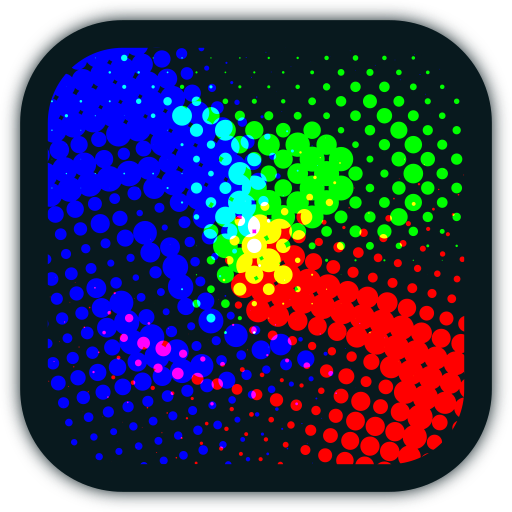
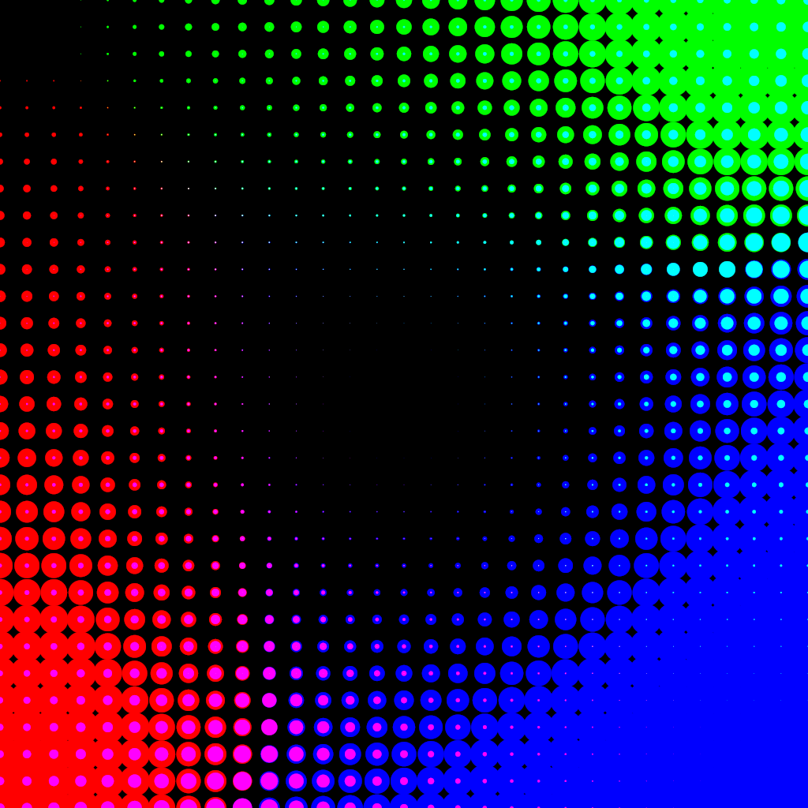
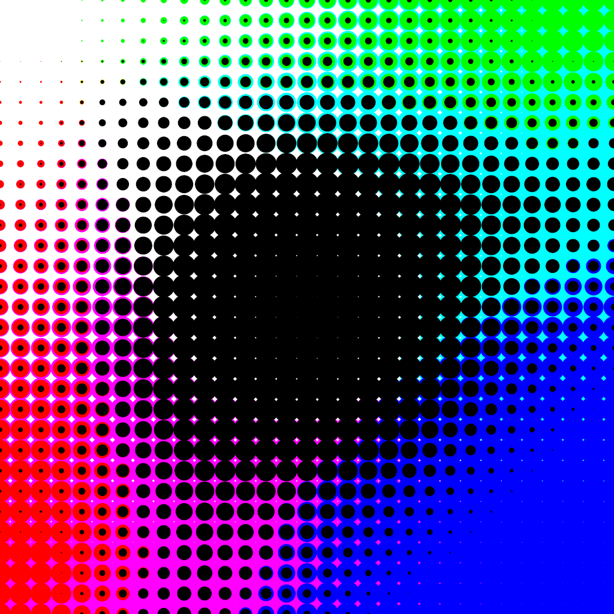

# Toniator

**Turn images into halftone artwork made from dots, lines, curves, and shapes.**

Toniator is a native Linux application for artists and designers who want to
explore the patterns behind an image. Open artwork, choose a Pattern, adjust its
scale and appearance, and export a PNG or editable SVG. Work in RGB, CMYK, or
source colors, with independent Pattern settings for each color channel.

Built with Rust and GTK4, Toniator includes a visual Pattern Wizard, a personal
Pattern library, and a headless command-line renderer. It is free software under
the [GPL-3.0-only license](LICENSE).

**Development version: 0.3.0 (unreleased). Latest published pre-release: 0.2.0.**
[Download the Linux packages](https://github.com/ricperry/Toniator/releases/tag/v0.2.0)
or [browse known issues](ISSUES.md).

## Examples

The same [source artwork](assets/raster-sample.png), rendered as circular marks
in two color modes. These are actual 1024×1024 PNG exports from Toniator 0.2.0,
with no image editing afterward. Open either image to inspect it at full size.

| RGB — colored marks on black | CMYK — overlapping ink colors on white |
| --- | --- |
|  |  |

Toniator also turns vector artwork into new editable geometry:
[source SVG](assets/vector-sample.svg) → [exported SVG](docs/examples/vector-dots.svg).
See [example settings and reproduction commands](docs/examples/README.md).

## Download and run

Download **one** of the x86_64 packages from the
[v0.2.0 release](https://github.com/ricperry/Toniator/releases/tag/v0.2.0).
Both include the graphical app and CLI, with application ID `com.sbdd.Toniator`.

### AppImage

In the folder containing your download:

```bash
chmod +x Toniator-0.2.0-x86_64.AppImage
./Toniator-0.2.0-x86_64.AppImage
```

This build requires **glibc 2.39 or newer**; it was tested on Fedora 44/Wayland.
If FUSE mounting is unavailable, run it with:

```bash
APPIMAGE_EXTRACT_AND_RUN=1 ./Toniator-0.2.0-x86_64.AppImage
```

### Flatpak

With Flatpak installed, run:

```bash
flatpak install --user ./Toniator-0.2.0-x86_64.flatpak
flatpak run com.sbdd.Toniator
```

The bundle uses the shared GNOME 50 runtime, which Flatpak may download during
installation. It is distributed here on GitHub; it is not a Flathub listing.
Flatpak keeps its own settings, recent files, and personal Patterns under
`~/.var/app/com.sbdd.Toniator/`, separate from a native or AppImage installation.

Download `SHA256SUMS` alongside the packages to verify their integrity with
`sha256sum --ignore-missing -c SHA256SUMS`. See the
[packaging guide](packaging/README.md) for permissions and build details.

## Make your first artwork

The fixed welcome window appears over the editor. Click the editor behind it,
press Escape, or close welcome to begin with an empty document. Recent Files
scrolls within its own bounded area.

1. Click **Start New Project** and select an image. The same button opens an
   existing `.toniator` project; **Recent Files** provides quick access later.
2. Choose a color mode and edit **All** channels together or select one channel.
3. Use **Change…** to choose a Pattern. Use it as supplied or edit its layout,
   placement, and styling in the Pattern Wizard.
4. Adjust Pattern size, rotation, and appearance. Use **Preview / Source** to
   compare the result with your original artwork, and zoom or Fit to inspect it.
5. Save a `.toniator` project to keep the source image and editable settings.
   Export **PNG** for a raster image or **SVG** for editable vector geometry.

Personal Patterns can be saved, updated, copied, renamed, and moved to recoverable
trash. Saving a Pattern to your library is separate from applying it to artwork.
In the development build, **New → Save preset** saves the whole design configuration
as a source-free `.toniator-preset`. **Load preset...** accepts that format or an
intact `.toniator` project, applies all channel settings, and keeps your current
artwork and canvas. Loading is one undoable change; saving a Preset does not save
the project. Open artwork before loading a Preset.
Undo and Redo operate on document edits. **Close** returns to startup; **Exit**
quits. Both prompt when a document has unsaved changes. The app follows the
system light/dark preference where supported.

Supported still-image inputs: PNG, SVG, JPEG, WebP, BMP, TIFF, OpenEXR, and AVIF.
PNG exports offer background, antialiasing, and output-size options. SVG exports
keep a transparent background. RGB PNG defaults to black, CMYK to white, and
source-color output to transparent.

### Animate artwork in the development build

The combined animation/video work is implemented in the development checkout
and undergoing final review; it is not part of the published 0.2.0 release.

1. Start a project with a video or animated image, or use **New → Import image
   sequence…** to review an ordered image list and its frame rate. Still images
   can also supply the artwork for an animation.
2. Edit **Start frame** with the normal Pattern, channel and appearance controls.
   In Advanced settings, assign **Color** with the picker or HEX entry and use
   **Alpha** for strength. These controls edit the currently selected frame.
3. Select **End frame** below the canvas. Its first selection copies the Start
   settings. Make the desired changes, then toggle between frames to inspect
   them. Each frame retains its settings. Changing one channel's Pattern
   reinitializes only its dependent End settings, preserving the other channels.
4. Choose interpolation in a property's Animation disclosure when needed.
   Use **Animation settings…** in the main menu for exact frame rate and source
   interval. The renderer interpolates supported continuous values between the
   two states; this version has no playback or scrubbing.
5. Export a PNG sequence or lossless **FFV1/Matroska** video. Optional
   **AV1/WebM** provides a smaller lossy sharing file with an opaque background.
   Choose a destination each time or save a personal folder default. Video uses
   private temporary PNGs, with recovery options if encoding fails.

Save the `.toniator` project to retain its source media and animation settings.
Project Preset loading keeps the current artwork and timing. Audio is retained
inside the original source but exports are silent. Variable-rate sources are
sampled at the displayed project rate; frames may repeat or be skipped.
Development builds need FFmpeg and ffprobe on PATH for moving media and video
export. The development AppImage and Flatpak bundle their own software tools;
see [the packaging guide](packaging/README.md).

## Build from source

Requirements: **Rust 1.94+**, a C compiler, `pkg-config`, **GTK 4.12+**, GLib
development tools, `blueprint-compiler`, and the native `dav1d` development
library for AVIF decoding. On Fedora, install the system dependencies with:

```bash
sudo dnf install git gcc pkgconf-pkg-config gtk4-devel glib2-devel \
  blueprint-compiler libdav1d-devel
```

Install a current Rust toolchain through [rustup](https://rustup.rs/), then:

```bash
git clone https://github.com/ricperry/Toniator.git
cd Toniator
cargo build --release --locked -p toniator-app -p toniator-cli
./target/release/toniator-app
```

To open the included sample directly:

```bash
./target/release/toniator-app assets/raster-sample.png
```

For development, `cargo run -p toniator-app` builds and launches the application.
For a headless build, use `cargo build --release --locked -p toniator-cli`;
GTK and Blueprint are unnecessary, but the native `dav1d` dependency still applies.

### Command-line rendering

Render a source image using the default circular-mark Pattern:

```bash
mkdir -p target/validation/examples
./target/release/toniator render \
  --input assets/raster-sample.png \
  --output target/validation/examples/halftone.png \
  --channel-model cmyk --density 30 --density-aspect 1 \
  --rotation 0 --offset-x 0 --offset-y 0 --guard-steps 2
```

Use an `.svg` output filename for vector export. Render a saved project using
its stored settings with `toniator render -i artwork.toniator -o artwork.svg`.
Run `toniator --help` or `toniator render --help` for the supported commands.

In an AppImage, prepend `./Toniator-0.2.0-x86_64.AppImage --cli` in place of
`toniator`. The Flatpak CLI is available through
`flatpak run --command=toniator com.sbdd.Toniator`; direct CLI file paths must be
accessible inside its sandbox.

### Build or publish the packages

The [packaging guide](packaging/README.md) covers building AppImage and Flatpak
bundles with the GNOME SDK. [Release instructions](docs/RELEASING.md) explain
GitHub tags, release notes, and uploading the packages.

## Development status

Toniator is a pre-release native rewrite. Project formats can change between
development versions; obsolete formats are rejected rather than automatically
migrated. Document-level **Presets** are implemented and user-accepted in the
development build, separately from the personal **Pattern** library. See the
[Gate 21B-5 record](docs/STAGE_21B_GATE5_IMPLEMENTATION.md) for the format and checks.

Known limitations include slow previews at very fine Pattern sizes, first-use
personal thumbnail latency, and an intermittent reported RGB-to-CMYK crash.
Second-launch forwarding, stale Preset actions, wizard dismissal and progress
reporting are fixed; dense circular-mark previews also avoid a quadratic lookup.
Details and follow-up work are in [ISSUES.md](ISSUES.md).
Package workflow checks use an isolated Wayland compositor; they do not claim
exhaustive GNOME/Mutter or native file-portal acceptance.

For development history and architecture, see [ProgressTracker.md](ProgressTracker.md),
the [rewrite plan](docs/GREENFIELD_REWRITE_PLAN.md), and
[current UI references](docs/ui/REFERENCES.md). The protected
[Addendum](Project%20Specification/Addendum.md) takes precedence over other design
documents. The GTK app and CLI share the same domain, evaluation, and rendering
core; the archived `ToniatorLegacy/` tree is a read-only reference.

Contributions follow [AGENTS.md](AGENTS.md): bounded changes, focused checks,
and inspection of real output. GTK controls need meaningful accessibility
names, roles, state, and keyboard paths; private Wayland checks verify semantic
actions and screenshots. Semantic-map is retired from this project's workflow.
