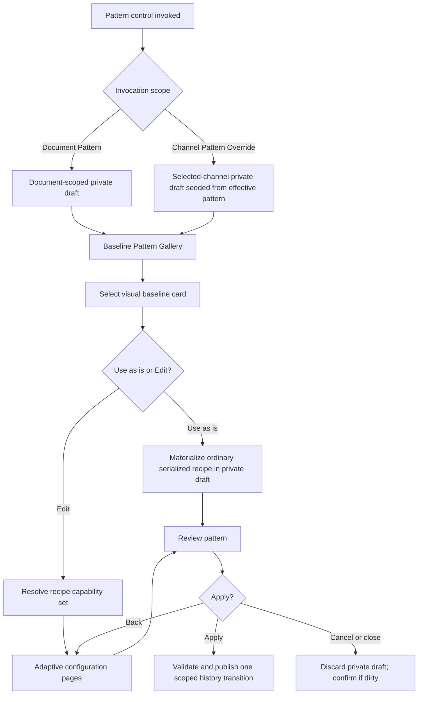
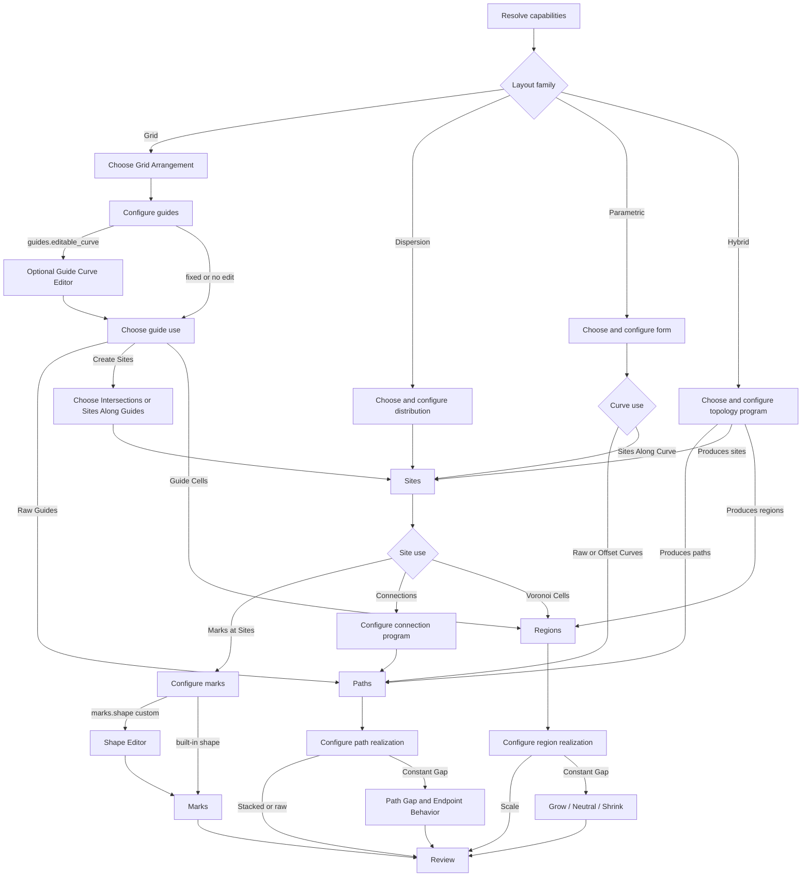

# Toniator Pattern Wizard Plan

Status: **approved future-work plan; implementation remains gated** (accepted
2026-08-22; Stage 20R accepted and stage allocation reconciled 2026-08-26).

This document records the intended replacement direction for the artist-facing
Pattern Editor workflow. It does not authorize implementation, change the
accepted Stage 20F–20R ledger state, or begin Stage 20S or Stage 21. The
user-authorized normative effective-pattern direction is recorded in the
protected specifications and implemented by accepted Stage 20G authority.
The complete Pattern Wizard remains a separately gated Stage 21 UI milestone
after the remaining Stage 20N–20S headless capabilities it exposes exist. The
2026-08-24 accepted remainder roadmap is
[`STAGE_20N_20S_HEADLESS_PATTERN_COMPLETION_PLAN.md`](STAGE_20N_20S_HEADLESS_PATTERN_COMPLETION_PLAN.md).

The plan is informed by the notes, visual studies, and representative pattern
assets under `assets/Stage20FCorrectionHints/`, the accepted Stage 20A–20R
architecture, the accepted Stage 20K implementation, the accepted Stage 20L
adjacency boundary, the accepted Stage 20F infrastructure, and the accepted
Stage 20O–20P engine sequence. Stage 20N supplies the multi-output and
canonical-region/render foundation; Stage 20O supplies ordinary Voronoi,
Stage 20P supplies Guide Faces, Stage 20Q supplies headless region treatments
and sampling, and Stage 20R supplies ordered heterogeneous outputs and site-use
filters. Stage 20S capability and recipe completion remains planned.

## Product direction

The artist-facing command is **Pattern Wizard**, not **Pattern Editor**. It
opens to a visual gallery of baseline patterns. After selecting a card, the
artist can:

- **Use as is**, which retains the baseline recipe and proceeds to Review; or
- **Edit**, which enters only the wizard pages enabled by that recipe's typed
  capabilities.

The wizard is adaptive. It has no fixed universal page count. It retains a
structural breadcrumb, live canonical preview, Back, Cancel, and Next/Review,
and it preserves compatible downstream state when the artist moves backward.

The following decisions organize the workflow:

- Use **Dispersion** as the artist-facing family name. Existing domain names
  such as `RandomSites` may remain internal until an authorized schema change.
- A named baseline or preset is data, never a renderer or evaluator switch.
- Capability projection determines pages and controls. The UI never branches
  on a preset name.
- The canvas clips final canonical geometry only. It never creates sites,
  connections, guide faces, Voronoi cells, maze boundaries, or endpoints.
- One- and two-guide arrangements may expose the Guide Curve Editor.
  Three-guide and four-guide arrangements use fixed straight directions.
- The Shape Editor appears only while configuring **Marks at Sites**. It is not
  a top-level editor and never appears for raw guides, connections, paths, or
  regions.
- **Stacked** and **Constant Gap** are path-realization choices, not site
  connection strategies.
- **Maze**, bounded random links, and a future traveling-salesperson route are
  connection programs that consume sites and produce paths.
- **Voronoi Cells** derive regions from sites. **Guide Cells** derive regions
  from closed guide faces. They converge only after a canonical Region exists.
- A square spiral (the visual “squiral”) is a Spiral configuration, not a
  separate generator.
- Tetragrid stays hidden under Advanced and must not block the primary wizard.
  It may be removed later if no concrete artistic workflow justifies it.

## Entry scope and effective document settings

The same wizard shell serves two explicit entry points. Its scope is supplied
by the control that invoked it; the wizard does not ask the artist to choose a
scope again.

| Entry point | Initial value | Apply target | Sharing rule |
|---|---|---|---|
| Document Pattern | Current document pattern, or gallery default | Document pattern | Channels without a pattern override follow it. |
| Channel Pattern Override | Existing channel override, otherwise the effective document pattern | Selected channel only | First edit creates an independent selected-channel recipe/resource set by default. |

The main inspector should group common controls at document level and show
channel deltas beneath an explicit **Override document settings** disclosure.
Resetting a channel delta restores inheritance.

| Effective setting | Document value | Channel value | Capability visibility |
|---|---|---|---|
| Pattern | Document recipe | Optional replacement recipe | Always |
| Pattern rotation | Base angle | Additive angle delta | All patterns |
| Shape rotation | Base mark angle | Additive angle delta | Mark realization only |
| Minimum / maximum fill | Base response range | Additive minimum / maximum deltas | Realizations declaring `response.fill_range` |
| Density / detail | Base density | Additive density delta | Generators declaring `generator.density` |

Effective continuous values are computed from the document value plus the
channel delta. The command boundary validates the effective result; it must not
silently clamp or reinterpret an invalid delta. Pattern angles may use their
normal angle equivalence, while fill bounds and density remain subject to their
typed finite/range invariants. A pattern override is a replacement recipe, not
a “topology delta.”

`response.fill_range` is an artist-facing concept with realization-specific
typed meaning:

- marks: normalized mark fill/size, already established by Stage 20E1;
- paths: normalized stroke-thickness response, after a headless path contract;
- regions: normalized inset/grow-shrink response, after a headless region
  contract.

The UI may present the common labels **Minimum fill** and **Maximum fill**, but
the domain must not pretend mark size, stroke thickness, and region inset are
the same stored field.

## Structural vocabulary

The wizard follows this type flow:

```text
Layout Family
  -> Generator
  -> Base Structure
  -> Optional Derivation
  -> Sites, Paths, or Regions
  -> Realization
  -> Canonical Geometry
  -> Final Canvas Clip
  -> Preview / Export
```

The earlier umbrella “connection strategy” is split into these distinct
artist decisions:

| Artist choice | Pipeline role | Input | Output |
|---|---|---|---|
| Marks at Sites | Site realization | Sites | Marks |
| Random/nearest links, Maze, TSP route | Connection program | Sites plus adjacency/program settings | Paths |
| Raw Guides / Raw Curve | Structural use | Guides or Curve | Paths |
| Stacked / Constant Gap | Path realization | Paths or path family | Visible path geometry |
| Voronoi Cells | Region derivation | Sites | Regions |
| Guide Cells | Region derivation | Closed guide faces | Regions |
| Scale / Constant Gap | Region realization | Regions | Visible region geometry |

## Capability flag contract

A capability flag is a stable, typed fact about what the current recipe and
headless engine can do. It is not GTK policy and is not a stored claim that the
UI trusts blindly.

For implementation, each flag needs four witnesses:

1. a typed input and output primitive;
2. a headless resolver that derives availability from the validated recipe;
3. descriptors/commands for every setting the flag exposes; and
4. focused evaluation and round-trip tests proving the path without preset-name
   dispatch.

Preset metadata may cache required flags for gallery filtering and explanatory
copy, but the authoritative set is derived from the materialized recipe and
the engine's supported capability graph. A card is available only when all of
its required flags are supported. Unsupported cards are omitted from the
normal gallery rather than leading to a dead wizard page.

### Flag-to-control matrix

| Stable flag | Meaning | Wizard page or control exposed | Current/planned backing |
|---|---|---|---|
| `family.grid` | Generator starts with guide dimensions | Grid Arrangement | Current family concepts |
| `family.dispersion` | Generator creates sites directly | Distribution | Current random-site family |
| `family.parametric` | Generator creates a mathematical curve | Parametric Form | Accepted headless Stage 20K; wizard exposure remains planned |
| `family.hybrid` | Generator owns specialized topology rules | Hybrid Structure | Future program contract |
| `generator.density` | Generator accepts document detail/density | Density / Detail control and channel delta | Current for grid/random; future elsewhere |
| `generator.seed` | Reproducible stochastic choice exists | Seed control and per-channel seed delta where defined | Current random; planned networks |
| `guides.count.1` | One repeated guide direction | One Guide arrangement card | Current schema |
| `guides.count.2` | Two crossing guide directions | Two Guides arrangement card | Current schema |
| `guides.count.3` | Fixed triangular lattice | Triagrid arrangement card and spacing/phase controls | Current straight dimensions; fixed UI policy |
| `guides.count.4` | Specialized four-direction lattice | Advanced Tetragrid card | Current cardinality; product use deferred |
| `guides.editable_curve` | Guide prototype may be authored | Per-guide **Edit curve…** button | Stage 20C/20D/20F infrastructure |
| `guides.fixed_straight` | Topology requires fixed directions | Read-only guide-direction summary and explanation | Required for Triagrid/Tetragrid |
| `guides.spacing` | Repeated guide distance is configurable | Guide Spacing | Current |
| `guides.phase` | Guide stack origin is configurable | Guide Phase | Current |
| `guides.raw_paths` | Generated guides may become paths | Raw Guides choice | Current headless Stage 20I; wizard exposure remains planned |
| `sites.intersections` | Eligible guide crossings produce sites | Guide Intersections choice; selected guide dimensions; merge tolerance under Advanced | Current |
| `sites.along_guides` | Arc-length intervals on guides produce sites | Sites Along Guides choice; Site Interval and Site Phase | Current |
| `sites.along_curve` | Intervals on a parametric curve produce sites | Sites Along Curve choice; Site Interval, jitter, seed | Accepted headless Stage 20K; wizard exposure remains planned |
| `sites.dispersed` | A distribution produces sites directly | Distribution character and density controls | Current raw/even/clustered |
| `sites.weighted` | Source data influences site density | Uniform / Source Weighted; source component, response, strength | Current |
| `sites.exclusion` | Candidate acceptance has a spacing policy | Overlap allowed / Minimum spacing / Visible-mark margin and amount | Current |
| `sites.connections` | Sites may be connected into paths | Connections choice; program, degree/distance rules, seed | Accepted headless Stage 20M; wizard exposure remains planned |
| `sites.tsp_route` | Sites may form one bounded ordered route | Traveling Route program; open/closed route and deterministic settings | Deferred separate program decision |
| `regions.voronoi` | Sites may form ordinary Voronoi regions | Voronoi Cells choice | Complete headless Stage 20O; wizard exposure remains separately planned |
| `regions.guide_faces` | Closed guide faces may form regions | Guide Cells choice | Stage 20P |
| `marks.at_sites` | Sites may realize marks | Marks at Sites choice and Configure Marks page | Current |
| `marks.shape` | Mark prototype is selectable | Circle / built-in / custom shape; **Edit shape…** | Current circle/authored shape; Stage 20F infrastructure |
| `marks.orientation` | Marks can follow a guide tangent/normal | Fixed / Tangent / Normal | Current guided products |
| `marks.rotation_jitter` | Each mark can receive deterministic variation | Rotation Jitter and seed | Future modulation contract |
| `paths.raw` | A structural path can be made visible | Configure Paths page | Current headless Stage 20I; wizard exposure remains planned |
| `paths.spacing.stacked` | Generated path positions are preserved | Stacked path-spacing choice | Current headless Stage 20I; wizard exposure remains planned |
| `paths.spacing.constant_gap` | Related paths are offset to a uniform gap | Constant Gap choice; Path Gap | Current headless Stage 20J; wizard exposure remains planned |
| `paths.endpoint_policy` | Constant-gap open paths extend tangentially beyond the padded generation bounds | Extend Beyond Canvas; Wrap Around Endpoint stays unavailable | Current headless Stage 20J policy; capability/wizard exposure planned and wrap-around deferred |
| `regions.realize.scale` | Regions scale about their reference | Scale choice and amount | Stage 20Q |
| `regions.realize.constant_gap` | Region boundaries offset by distance | Constant Gap choice and signed Grow/Neutral/Shrink amount | Stage 20Q |
| `response.fill_range` | Output supports document/channel response range | Minimum Fill / Maximum Fill in Review and main inspector | Current marks and paths; planned regions |
| `output.composite` | More than one ordered realized output exists | Ordered Outputs page | Stage 20R |

The dotted “stacked” and “even gaps” guide studies appear to describe two site
sampling modes: cross-stack alignment versus independent equal-arc intervals.
Only equal-arc `sites.along_guides` is established today. A later headless
contract must settle whether aligned sampling is a distinct capability; the UI
must not reuse the path-realization word **Stacked** for it until then.

## Baseline pattern capability matrix

The following rows are visual baselines, not new evaluator variants. Several
rows intentionally share one generator and differ only in derivation or
realization flags.

Availability terms:

- **Current engine**: accepted Stage 20A–20R authority exists; Stage 20F owns only bounded
  authoring exposure, not the final wizard.
- **Accepted 20O–20R / Planned 20S+**: Stages 20L–20R name accepted headless
  primitives; later rows name planned headless capabilities. Their wizard
  exposure may remain separately planned.
- **Future contract**: the supplied asset expresses intent, but no existing
  stage contract yet owns all required behavior.
- **Advanced/deferred**: excluded from the primary workflow until justified.

### Grid baselines

| Baseline card | Structural recipe | Required capability flags | Artist controls revealed | Availability | Representative asset |
|---|---|---|---|---|---|
| One Guide — Lines | One straight guide family -> paths | `family.grid`, `guides.count.1`, `guides.spacing`, `guides.phase`, `guides.raw_paths`, `paths.raw` | Guide spacing/phase; path thickness/fill response | Current headless Stage 20I; wizard card planned | `lingrid.svg` |
| One Guide — Curved Lines | One authored guide family -> paths | Prior row plus `guides.editable_curve` | Edit curve; guide repetition; path controls | Current headless Stage 20I; wizard card planned | `lingrid-curve-stacked.svg` |
| One Guide — Constant Gap Curves | One authored guide -> offset path family | Prior row plus `paths.spacing.constant_gap`, `paths.endpoint_policy` | Path Gap; Extend Beyond Canvas endpoint summary | Current headless Stage 20J; wizard card planned | `lingrid-curve-even-gaps.svg` |
| One Guide — Marks | One guide -> sites along guide -> marks | `family.grid`, `guides.count.1`, `sites.along_guides`, `marks.at_sites`, `marks.shape`, `response.fill_range` | Site interval/phase; mark shape; fill | Current engine | `lingrid-dots.svg`, `MarksAlongGuide.svg` |
| Curved Guide — Even-Interval Marks | Authored guide stack -> equal-arc sites -> marks | Prior row plus `guides.editable_curve` | Edit curve; equal-arc Site Interval | Current engine | `lingrid-dots-even-gaps.svg` |
| Curved Guide — Aligned Marks | Authored guide stack -> aligned sites -> marks | Prior row plus a not-yet-defined aligned-sampling flag | Alignment origin/spacing after semantics exist | Future contract | `lingrid-dots-stacked.svg` |
| Two Guides — Lines | Two guide families -> paths | `family.grid`, `guides.count.2`, `guides.raw_paths`, `paths.raw`, `paths.spacing.stacked` | Guide A/B; spacing/phase; path controls | Current headless Stage 20I; wizard card planned | `squagrid.svg` |
| Two Curved Guides — Lines | Two authored guide families -> paths | Prior row plus `guides.editable_curve` | Edit Guide A/B; path controls | Current headless Stage 20I; wizard card planned | `squagrid-curve.svg` |
| Two Guides — Intersection Marks | Two guides -> intersection sites -> marks | `family.grid`, `guides.count.2`, `sites.intersections`, `marks.at_sites`, `marks.shape`, `marks.orientation`, `response.fill_range` | Guide A/B; intersection source; mark controls | Current engine | `squagrid-dots.svg`, `MarksAtIntersections.svg` |
| Two Curved Guides — Intersection Marks | Two authored guides -> intersection sites -> marks | Prior row plus `guides.editable_curve` | Edit Guide A/B; mark controls | Current engine | `squagrid-curve-dots.svg` |
| Triagrid — Lines | Three fixed straight directions -> paths | `family.grid`, `guides.count.3`, `guides.fixed_straight`, `guides.raw_paths`, `paths.raw` | Spacing/phase only; guide-editor explanation | Current headless Stage 20I; wizard card planned | `triangrid.svg` |
| Triagrid — Marks | Three fixed directions -> intersection sites -> marks | Prior row plus `sites.intersections`, `marks.at_sites`, `marks.shape` | Intersection set; mark controls | Current engine | `triangrid-dots.svg` |
| Tetragrid | Four fixed straight directions -> selected product | `family.grid`, `guides.count.4`, `guides.fixed_straight` plus chosen use flags | Advanced spacing/phase and supported use only | Advanced/deferred | `tetragrid.svg` |
| Guide Cells | Closed faces from eligible guides -> regions | `family.grid`, `regions.guide_faces`, then a region-realization flag | Guide topology; Scale or Constant Gap region controls | Complete headless Stage 20P and 20Q; wizard exposure remains planned | `CellsGrid.svg` |
| Grid Voronoi | Grid sites -> Voronoi -> regions | A valid grid site source plus `regions.voronoi`, then a region-realization flag | Site source; Voronoi; region controls | Complete headless Stage 20O and 20Q; wizard exposure remains planned | `Voronoi_GridFamily.svg` |

The `GridShapesMaster.svg` layer labelled “triangrid-curve - does not work -
invalid intersections” is treated as a negative design witness: Triagrid and
Tetragrid must not enable `guides.editable_curve`.

### Dispersion baselines

| Baseline card | Structural recipe | Required capability flags | Artist controls revealed | Availability | Representative asset |
|---|---|---|---|---|---|
| Even Dispersion — Marks | Even/minimum-distance sites -> marks | `family.dispersion`, `generator.density`, `generator.seed`, `sites.dispersed`, `sites.exclusion`, `marks.at_sites`, `marks.shape`, `response.fill_range` | Density; seed; minimum separation/margin; mark controls | Current engine | `poisson-disc.svg` |
| Source-Weighted Dispersion — Marks | Weighted sites -> marks | Prior row plus `sites.weighted` | Source component; invert/gain/bias; weighting response/strength | Current engine | Uses the Poisson-disc baseline thumbnail until a dedicated study exists |
| Clustered Dispersion — Marks | Clustered sites -> marks | `family.dispersion`, `generator.density`, `generator.seed`, `sites.dispersed`, `sites.exclusion`, `marks.at_sites` | Cluster density/spread/strength; exclusion; mark controls | Current engine | Uses the dispersion family visuals |
| Connected Dispersion | Dispersed sites -> bounded connection program -> paths | Dispersion flags plus `sites.connections`, `paths.raw` and a path-spacing choice | Minimum/maximum links; maximum distance; selection bias; seed; path controls | Accepted headless 20M; wizard card remains planned | `poisson-disc-connected.svg` |
| Traveling Route | Weighted or unweighted sites -> one ordered route -> path | A site source plus `sites.connections`, `sites.tsp_route`, `paths.raw` | Open/closed route; deterministic route settings; path controls | Deferred separate program decision | `TSP_example.png` |
| Dispersion Voronoi | Dispersed sites -> Voronoi -> regions | Dispersion site flags plus `regions.voronoi` and a region-realization flag | Distribution; Voronoi; Scale or Constant Gap | Complete headless Stage 20O and 20Q; wizard exposure remains planned | Reuses the Voronoi structural thumbnail with a dispersion source |

### Parametric baselines

| Baseline card | Structural recipe | Required capability flags | Artist controls revealed | Availability | Representative asset |
|---|---|---|---|---|---|
| Spiral — Line | Spiral(shape: round) -> path | `family.parametric`, `paths.raw` | Turns; radial spacing; phase; winding; path controls | Accepted 20K; wizard card remains planned | `spiral.svg` |
| Spiral — Marks | Spiral(shape: round) -> sites along curve -> marks | `family.parametric`, `sites.along_curve`, `marks.at_sites`, `marks.shape` | Spiral controls; Site Interval/jitter/seed; mark controls | Accepted 20K; wizard card remains planned | `spiral-dots.svg` |
| Square Spiral — Line | Spiral(shape: square) -> path | Same as Spiral — Line; shape is data | Shape; turns; spacing; phase; path controls | Accepted 20K; wizard card remains planned | `squiral.svg` |
| Square Spiral — Marks | Spiral(shape: square) -> sites -> marks | Same as Spiral — Marks; shape is data | Shape; site interval; mark controls | Accepted 20K; wizard card remains planned | `squiral-dots.svg` |

Rosette, Lissajous, Trochoid, and Radial Wave remain separately gated
additional generator configurations now that the common parametric-curve
contract exists. They do not justify preset-specific render paths.

### Hybrid and connection-program baselines

| Baseline card | Structural recipe | Required capability flags | Artist controls revealed | Availability | Representative asset |
|---|---|---|---|---|---|
| Maze — Two Guide | Two-guide sites/adjacency -> maze program -> paths | `family.hybrid`, `guides.count.2`, `generator.seed`, `sites.connections`, `paths.raw` | Guide basis; maze seed/program settings; path controls | Accepted headless 20M; wizard card remains planned | `maze2.svg` |
| Maze — Three Guide | Fixed Triagrid sites/adjacency -> maze program -> paths | Prior row with `guides.count.3`, `guides.fixed_straight` | Spacing/phase; maze seed; path controls; no curve editor | Accepted headless 20M; wizard card remains planned | `maze3.svg` |
| User-defined Motif | Grid structure -> authored topology program | Future motif capability plus matching output primitive | Motif editor only after a bounded headless contract | Deferred | No canonical asset yet |

Maze is shown under Hybrid for artist discovery, while its reusable machinery
should still be a normal adjacency/connection program over an eligible site
set. The family label must not create a separate maze renderer.

## Wizard flow

### Entry, baseline selection, and commit



Selecting **Use as is** does not mutate the main document immediately. It
places the baseline in the same private draft used by Edit and proceeds to
Review. Apply publishes one document-scoped or selected-channel-scoped history
transition. Cancel leaves main history and preview authority unchanged.

### Adaptive edit branch



The resolver omits branches whose flags are absent. It does not display a full
tree of disabled controls. A concise explanation may replace a deliberately
unavailable action, such as “Triagrid guide directions remain straight to
preserve regular intersections.”

## Logical wizard pages

Pages may merge when the active branch has little to configure, but each page
has one artist question.

| Logical page | Artist question | Appears when |
|---|---|---|
| Baseline Pattern Gallery | “Which result is closest to what I want?” | Always |
| Grid Arrangement | “How many guide directions organize the pattern?” | `family.grid` |
| Guide Layout | “How are the guides shaped and repeated?” | Any guide generator |
| Guide Use | “Should these guides become paths, sites, or cells?” | At least two valid guide uses |
| Site Source | “Where should sites be created?” | More than one site derivation is valid |
| Distribution | “How should sites be dispersed?” | `family.dispersion` |
| Parametric Form | “Which mathematical curve and parameters?” | `family.parametric` |
| Hybrid Structure | “Which specialized topology?” | `family.hybrid` |
| Site Use | “Should sites become marks, connections, or Voronoi cells?” | Sites exist |
| Configure Marks | “What should be drawn at each site?” | `marks.at_sites` |
| Configure Connections | “How should eligible sites connect?” | `sites.connections` |
| Configure Paths | “How should paths become visible?” | Paths exist |
| Configure Regions | “How should regions become visible?” | Regions exist |
| Ordered Outputs | “How should multiple outputs be layered?” | `output.composite` |
| Review | “Is this the pattern to apply?” | Always after a valid terminal realization |

The breadcrumb describes structure rather than an arbitrary step count, for
example:

- `Grid › Two Guides › Intersections › Marks › Custom Shape`
- `Dispersion › Even › Connections › Constant Gap Paths`
- `Parametric › Spiral: Square › Sites Along Curve › Marks`
- `Grid › Two Guides › Guide Cells › Constant Gap Regions`

## Subeditor boundaries

### Guide Curve Editor

The Guide Curve Editor is launched only from a specific editable guide on the
Guide Layout page. It edits one open curve with Accept/Cancel and returns to
the wizard. It does not choose a family, site source, mark, or realization.
Triagrid and Tetragrid never expose it.

### Shape Editor

The Shape Editor is launched only from **Configure Marks** after the artist has
chosen **Marks at Sites** and a custom shape. It edits one closed shape with
Accept/Cancel and returns to the wizard. No other branch invokes it.

Both subeditors operate inside the wizard's private draft. An incomplete local
construction blocks the subeditor's Accept, not the entire main document. A
subeditor Cancel restores the exact pre-entry wizard draft.

## Default gallery behavior

Baseline cards use the supplied SVG/PNG studies as design references and later
should use exact output from ordinary serialized recipes as canonical
thumbnails. Until a recipe is executable through the normal headless path, its
card must not appear in the production gallery.

Each card contains:

- representative thumbnail;
- artist-facing name and one-sentence result description;
- family and optional tags;
- **Use as is** primary action;
- **Edit** secondary action; and
- an optional **Duplicate** action for user-owned presets.

Recommended filters are All, Grid, Dispersion, Parametric, and Hybrid. Tags may
include Marks, Lines, Cells, Connected, Maze, Organic, Geometric, Radial,
Sparse, and Dense. Filters and tags are metadata only.

The first production gallery should contain only capability-complete recipes.
With today's headless engine, viable candidates are mark-producing baselines:

- Even Dispersion — Marks;
- Source-Weighted Dispersion — Marks;
- One Guide — Marks;
- Two Guides — Intersection Marks;
- Two Curved Guides — Intersection Marks;
- Triagrid — Marks; and
- authored-shape variants of those site generators.

Raw guide/curve, connections, maze, Voronoi, guide-cell, and constant-gap cards
join the gallery only after their corresponding headless stages are accepted.

## State, validation, and accessibility

- The wizard owns one immutable-base private document/history draft.
- Back preserves compatible values and resets only values whose typed input
  primitive or capability became invalid.
- Changing a family or generator never reinterprets an old numeric field as a
  different concept.
- Apply is enabled only for a valid complete recipe that differs from its base.
  Pending preview rendering does not disable Apply; incomplete subeditor input
  does.
- The live preview preserves its last successful image and uses the existing
  matching-ticket stale-completion rules.
- Visual cards expose accessible names, selected state, concise descriptions,
  and equivalent keyboard navigation.
- Breadcrumbs are programmatically exposed as ordered status/context, not only
  painted text.
- Every graphical manipulation has numeric keyboard and assistive-technology
  parity where the underlying capability is numeric.
- Focus returns to the invoking control after a subeditor closes and to the
  invoking main-window pattern control after the wizard closes.
- Narrow layouts keep preview, current question, and persistent navigation in
  normal scroll flow. No fixed sidebar may reduce the primary control surface
  to a sliver.

## Headless and UI implementation boundary

Future engine stages should add typed capabilities and settings first. They do
not need to build wizard pages while the engine sequence is still underway.
For each new capability, the headless checkpoint should establish:

- stored intent and stable IDs where applicable;
- input/output primitive compatibility;
- command, descriptor, history, validation, and invalidation behavior;
- deterministic evaluation, limits, cancellation, and cache identity;
- current-format save/reopen and preset reconstruction; and
- canonical preview/PNG/SVG parity through the ordinary pipeline.

A later wizard milestone may then compose accepted capabilities without owning
geometry or inventing frontend-only document state. The approved order is:

| Stage | Headless or UI outcome |
|---|---|
| 20G | Effective document pattern authority: base recipe/settings, replacement recipes, typed deltas, reset/inherit, validation, invalidation, and current-only persistence. |
| 20H | Read-only typed capability projection from validated recipes and accepted primitives. |
| 20I | Canonical raw paths and strokes. |
| 20J | Path offset and Constant Gap realization. |
| 20K | **Complete at `f848ff995c9e30f89a85fbc01b5b8d97cc8de3d5`:** common parametric curves, initially round and square spirals, with verified five-turn intrinsic raw-path/equal-arc evidence. |
| 20L | **Complete at `b41fa3fcf2e1089ea422ba18524c2c4a26f568e8`:** mechanism-neutral site adjacency over eligible `FamilySiteSet` outputs; user accepted on 2026-08-23. |
| 20M | **Complete at `33f1bde3be9afdc3fb88f479c4ee7ec52b80114a`:** bounded nearest/random/tree connection programs and conventional two-/three-guide wall mazes; user accepted on 2026-08-24. |
| 20N | **Complete at `b8701686042a69fcd1ac68a4038adbad4c0ccdc9`:** ordered per-output settings, current-only document-v5/preset-v3 transition, independently keyed realization/cache units, and canonical filled-region/render foundation; concrete region sources and heterogeneous output remain deferred. |
| 20O | **Complete at `7ab97f01ec372ab1e6201b3913742476a1511c02`:** ordinary Voronoi regions from eligible `FamilySiteSet` products, including along-guide and `AlongParametricCurveSites`; direct raw `ParametricPaths` are excluded. Exact duplicates co-own regions; Spade remains private; authored v5/v3 persistence, fixed solid Full, and final clipping only. |
| 20P | **Complete at `cd531eb65dd2e161e62f355905ad936b8c1ca3c4`:** guide-arrangement faces from two or three selected straight or authored-open guide dimensions, with deterministic bounded canonical regions, authored v5/v3 persistence, and final clipping. The production 0/60/120 witness proves equal physical spacing and three-line equilateral faces; existing generic one-through-four guide support is unchanged and Stage 20P adds no four-guide behavior or evidence. |
| 20Q | **Complete at `071f3604098c0660a876fbe30050a64223fe41b3`:** fill-only Full, Scale, and Constant Gap region realization with reference/area-average sampling. |
| 20R | **Complete at `458c9a981dd349999240a18052e055a71c7b6c3c`:** ordered typed composite outputs and site-use dependency filters. |
| 20S | Headless capability completion and ordinary serialized gallery recipes. |
| 21 | Pattern Wizard gallery, adaptive pages, Review, and nested subeditors. |
| 22 | Headless frame/media authority, frame sequences/export, and simple start/end transitions. |
| 23 | Temporal GTK with descriptor-driven start/end pins only. |

Stages 20G–20R are accepted headless authority; Stage 20S and Stage 21–23
remain separately gated. TSP,
aligned curved-guide sampling, wrap-around constant-gap
endpoints, user-defined motifs, additional parametric forms, and the Tetragrid
decision remain deferred rather than silently entering a listed stage.

The final wizard must remain a projection of ordinary typed recipes. No preset
name, thumbnail, family label, or wizard page is permitted to select hidden
renderer behavior.

## Stage 20F boundary

This plan deliberately does not make a complete wizard a Stage 20F closeout
requirement. Stage 20F's reusable value is:

- private draft/squash behavior;
- exact authored open-guide and closed-shape editing;
- explicit Apply/Cancel and stale-preview handling;
- typed resource-use and copy/shared semantics; and
- the Guide Curve Editor and Shape Editor interaction foundations.

The current two-modal surface should be treated as provisional technical
exposure, not the final artist workflow. Its direct inspector actions are
named **Edit guide paths…** and **Edit mark shapes…** to make that resource
scope explicit. Closing Stage 20F does not approve the old “Pattern Editor”
organization as the future product design, and this plan does not authorize
replacing it yet. `GuideCustomAlongLayout` remains a Stage 20F compatibility
convenience and migrates in Stage 21 to an artist-selected guide use.

## Decisions required before wizard implementation

The following remain deliberately outside Stage 20F and require explicit
contracts before UI work:

- whether aligned sites across a curved guide stack are a distinct supported
  sampling mode;
- the initial connection programs and their legal degree/distance rules;
- whether the traveling-salesperson route is open, closed, or both, and its
  deterministic work limits;
- whether wrap-around Constant Gap endpoints belong with Stage 20M connection
  programs or a later separate contract; Stage 20J accepts tangential extension
  beyond the padded generation bounds only;
- region fill/outline and Scale versus Constant Gap defaults;
- additional parametric generator forms beyond the accepted Stage 20K set and
  their coverage model;
- whether Tetragrid has enough artistic value to retain; and

The document-level pattern plus channel-delta schema direction is normative;
its exact current-only serialization, validation, and command shape are owned
by the accepted Stage 20G implementation.

These decisions should be settled in the owning headless stages. The wizard
should expose accepted capability, not serve as the place where engine
semantics are invented.
